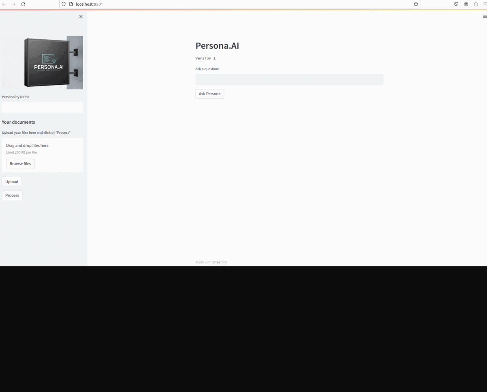
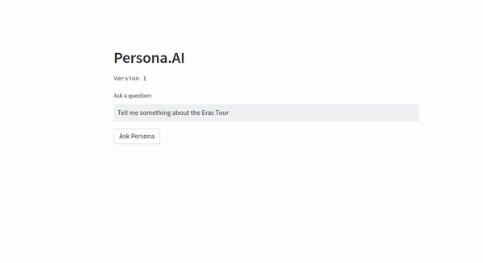

# Persona.AI
Recreate the Personality with Just an Document Upload


## Installation

Install all dependencies from requirements.txt

```bash
 pip3 install -r requirements.txt
```
    
You will need to install the 'punkt' Module of Nltk Library too,
Simply Login Your Terminal with Python

```bash
python3 
>> import nltk
>> nltk.download('punkt')
>> # After the package is downloaded - exit()
>> exit()
```


## Deployment

To deploy this project run

```bash
  streamlit run app.py
```


## Demo

### 1. Select and Upload Files  <br />
 <br />

### 2. Train Your Data and Wait for Processing <br />
.gif) <br />

### 3. Ask Your Answer  <br />

